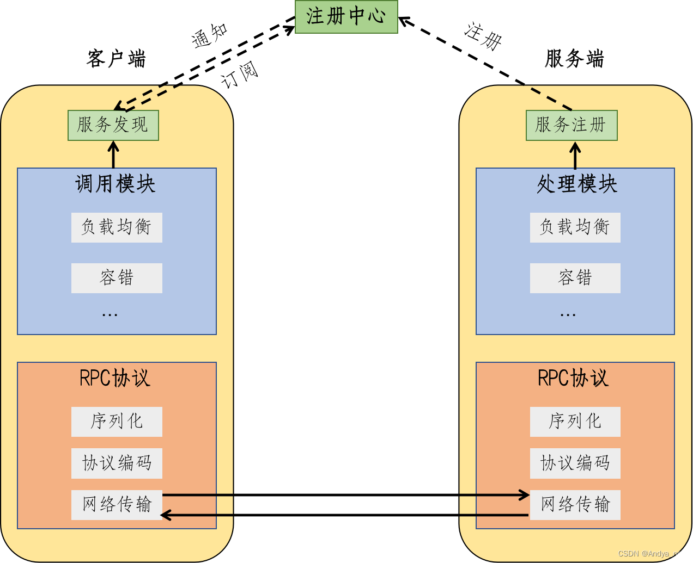
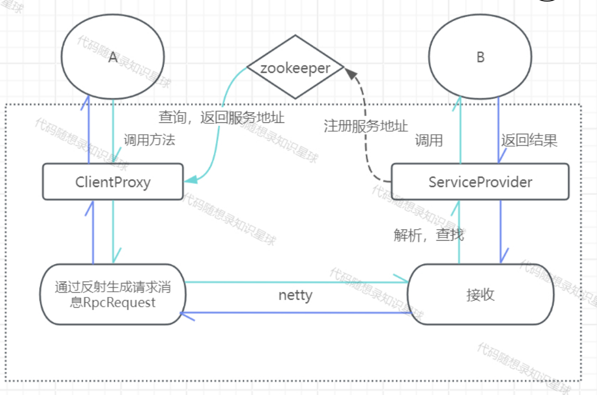
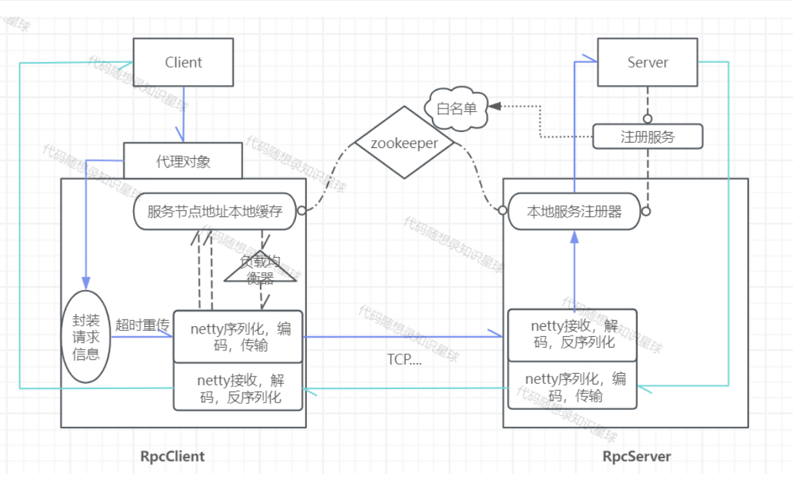
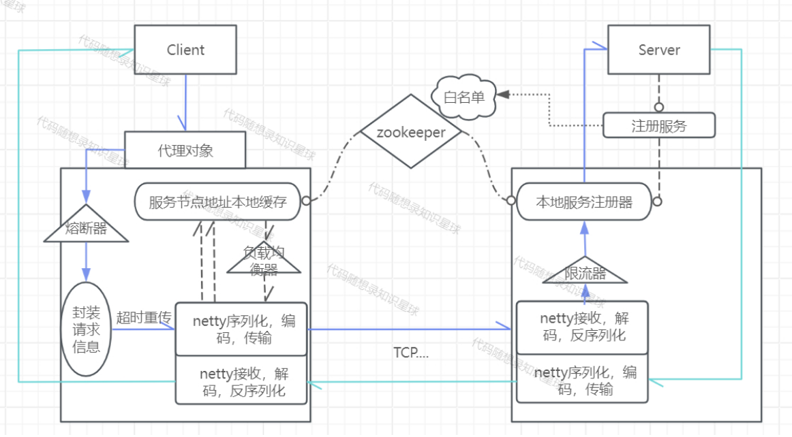
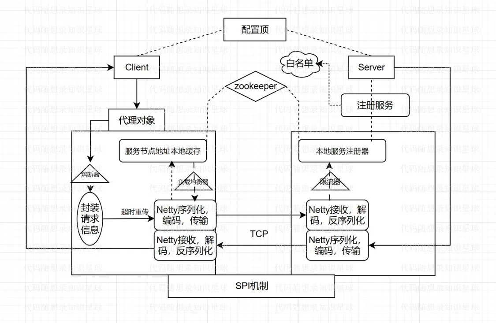

# RPC-Java

> ⭐️ 本项目为[【代码随想录知识星球】](https://programmercarl.com/other/kstar.html) 教学项目   
> ⭐️ 在 [手撕RPC项目文档](https://www.programmercarl.com/other/project_rpc.html)  里详细讲解：**项目前置知识 + 项目细节 +  代码解读 + 项目难点 + 面试题与回答 + 简历写法  + 项目拓展**。 全面帮助你用这个项目求职面试！

## 启动流程

1.先安装并开启zookeeper

安装参考：

[【Zookeeper】Windows下安装Zookeeper（图文记录详细步骤，手把手包安装成功）_windows安装zk-CSDN博客](https://blog.csdn.net/tttzzzqqq2018/article/details/132093374?ops_request_misc=%257B%2522request%255Fid%2522%253A%2522172149339116800211548359%2522%252C%2522scm%2522%253A%252220140713.130102334)

2.运行Server包下的TestServer,再运行Client包下的TestClient

# RPC概念

### 概念

1. RPC（Remote Procedure Call Protocol） 远程过程调用协议。
2. RPC是一种通过网络从远程计算机程序上请求服务，不需要了解底层网络技术的协议。
3. RPC主要作用就是不同的服务间方法调用就像本地调用一样便捷。

### 常用RPC技术或框架

应用级的服务框架：阿里的 Dubbo/Dubbox、Google gRPC、Spring Boot/Spring Cloud。
远程通信协议：RMI、Socket、SOAP(HTTP XML)、REST(HTTP JSON)。
通信框架：MINA 和 Netty

### 为什么要有RPC？

1. 服务化：微服务化，跨平台的服务之间远程调用；
2. 分布式系统架构：分布式服务跨机器进行远程调用；
3. 服务可重用：开发一个公共能力服务，供多个服务远程调用。
4. 系统间交互调用：两台服务器A、B，服务器A上的应用a需要调用服务器B上的应用b提供的方法，而应用a和应用b不在一个内存空间，不能直接调用，此时，需要通过网络传输来表达需要调用的语义及传输调用的数据。

#### 使用场景

1. `大型网站`：内部涉及多个子系统，服务、接口较多。
2. `注册发现机制`：如Nacos、Dubbo等，一般都有注册中心，服务有多个实例，调用方调用的哪个实例无感知。
3. `安全性`：不暴露资源
4. `服务化治理`：微服务架构、分布式架构。

### 架构图

### 核心功能概念

核心功能实现主要分为**服务寻址**、**序列化和反序列化**、**网络传输功能**。

#### 服务寻址功能

**Call ID映射：**

​	本地：在本地方法调用中，函数体是直接通过函数指针来指定的，但是在远程调用中，由于两个进程的地址空间完全不一样，函数指针不起作用。
​	远程：RPC中所有函数或方法都有自己的一个ID，在所有进程中都唯一。客户端在做远程过程调用时，必须附上这个ID，即客户端会查一下表，找出相应的Call ID，然后传给服务端，服务端也会查表，来确定客户端需要调用的函数，然后执行相应函数的代码。
​	Call ID映射表一般是一个哈希表。

#### 序列化和反序列化功能

**概述：**

- 序列化：将消息对象转换为二进制流。
- 反序列化：将二进制流转换为消息对象。

**必要性**：
远程调用涉及到数据的传输，在本地调用中，只需要将数据压入栈中，然后让函数去栈中读取即可。
但远程的数据传输，由于客户端和服务端不在同一个服务器上，涉及不同的进程，不能通过内存传递参数，此时就需要将客户端先将请求参数转成字节流（编码），传递给服务端，服务端再将字节流转为自己可读取格式（解码），这就是序列化和反序列化的过程。反之，服务端返回值也逆向经历序列化和反序列化到客户端。

**序列化的优势：**
将消息对象转为二进制字节流，便于网络传输。
可跨平台、跨语言。如Python编写的客户端请求序列化参数传输到Java编写的服务端进行反序列化。

#### 网络传输功能

**作用**：

- 客户端将Call ID和序列化后的参数字节流传输给服务端。
- 服务端将序列化后的调用结果回传给客户端。

**协议**：
  主要有TCP、UDP、HTTP协议。

**基于TCP协议**

​	客户端和服务端建立Socket连接。
​	客户端通过Socket将需要调用的接口名称、方法名称及参数序列化后传递给服务端。
服务端反序列化后再利用反射调用对应的方法，将结果返回给客户端。

**基于HTTP协议**

​	客户端向服务端发送请求，如GET、POST、PUT、DELETE等请求。
​	服务端根据不同的请求参数和请求URL进行方法调用，返回JSON或者XML数据结果。

**TCP和HTTP对比**

- 基于TCP协议实现的RPC调用，由于是底层协议栈，更佳灵活的对协议字段进行定制，可减少网络开销，提高性能，实现更大的吞吐量和并发数。但**，底层复杂，实现代价高**。
- 基于HTTP协议实现的RPC调用，已封装实现序列化，但HTTP属于应用层协议，HTTP传输**所占用的字节数比TCP更高，传输效率对比TCP较低**。

# 版本一

**part1**

- 实现基本的rpc调用
- 客户端动态代理
- 定义统一的request和response

**part2**

- 引入netty框架进行信息传输
- 自定义消息格式

**part3**

- 引入zookeeper作为注册中心

# 版本二

**part1**

- netty自定义编码器，解码器和序列化器

**part2**

- 在客户端建立本地服务缓存

- 实现本地缓存的动态更新

  

# 版本三

**part1**

- 实现客户端的负载均衡

**part2**

- 实现客户端的容错：失败重传
- 服务白名单

# 版本四

**part1**

- 服务限流，降级的实现
- 熔断器的实现

# 版本五

- SPI机制
- 配置顶
- 新增kryo、Hessian、protostuff等序列化方式
- 优化关闭方法

# TodoList

- [ ] 使用注解注册服务，消费服务

- [ ] 主动下线失败次数过多的节点

- [ ] 探测离线节点的状态，对恢复正常的节点重新上线

- [ ] 实现自适应的负载均衡器

  
